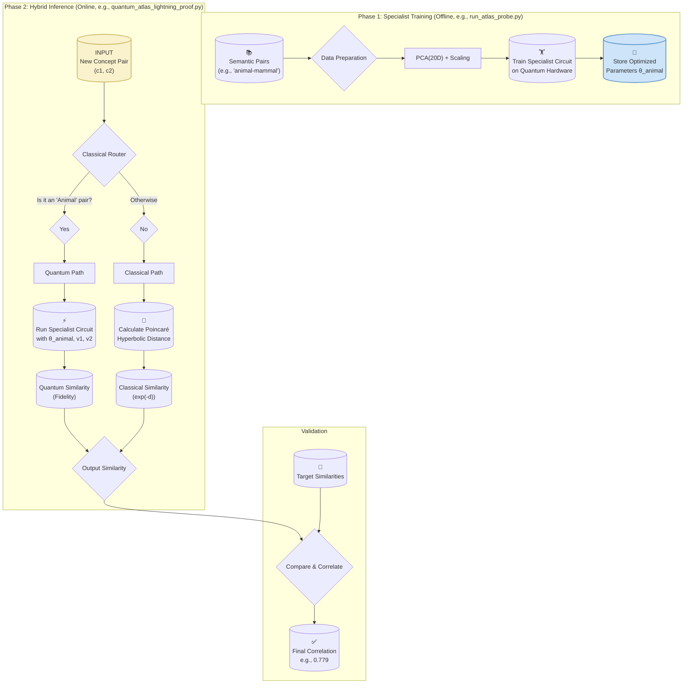

# Quantum Atlas: System Overview

This diagram provides a high-level overview of the complete Quantum Atlas architecture, from initial data processing to the final hybrid validation. It shows the two main phases: **Specialist Training** (offline) and **Hybrid Inference** (online).

